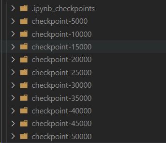
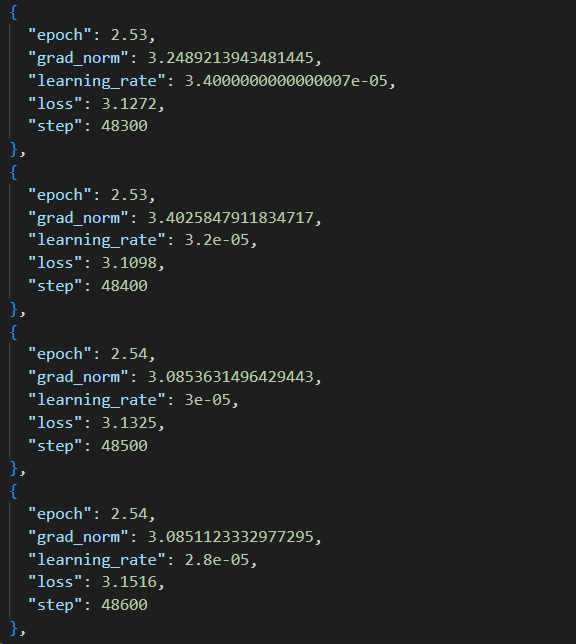
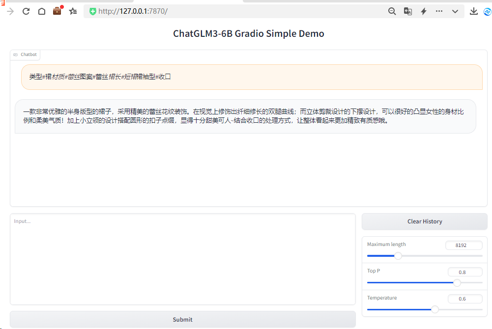

# 使用官方提供的示例，成功微调出广告数据集，要求使用 Lora 进行微调：

## 你能看到 loss 的下降，并在最终回到 0.8 左右。

调试了多次超参数，per_device_train_batch_size=6 、learning_rate、以及max_steps=50000
执行结果页面：executed_lora_finetune.ipynb

## 你需要自己适配 inference.py 中的代码，并迁移到其他的推理框架中。例如，basic_demo 中没有读取微调模型后的 adapter 的内容，你需要参考 inference.py 的代码并进行修改，让其他 demo 能读入你的微调代码，将其部署到 basic_demo 下的 gradio_demo 中，并能够通过 webui 来进行调用。

